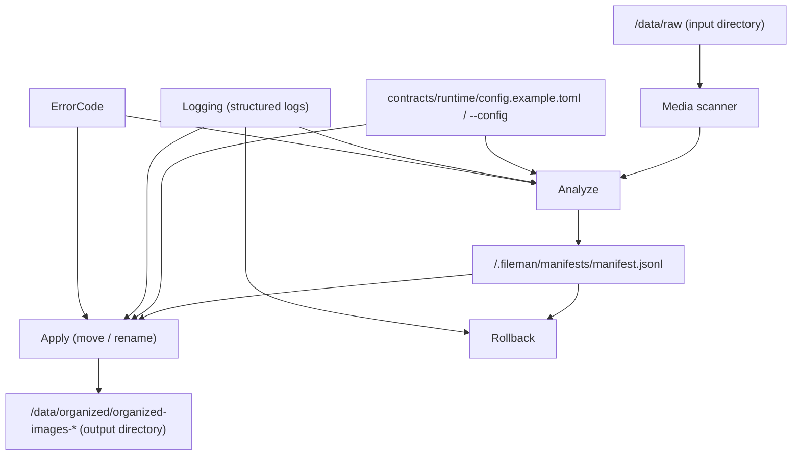
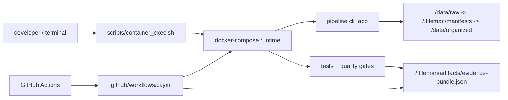

# Architecture And Data Flow



## Core Modules

- `packages/infrastructure/media_scanner.py`: file scanning and media-type detection
- `packages/application/analyze_media.py`: manifest generation, including concurrency and offline mode
- `packages/application/apply_command.py`: deterministic apply by manifest, with idempotent / recoverable behavior
- `packages/infrastructure/manifest_store.py`: manifest IO and schema validation
- `packages/observability/logging_utils.py`: structured logging
- `packages/infrastructure/config_loader.py`: config loading

## Layer Responsibilities

| Layer | Directory | Responsibility | Key Files |
| --- | --- | --- | --- |
| CLI orchestration | `apps/cli/` | argument parsing, command routing, stage orchestration (`analyze/apply/rollback/report`) | `cli_app.py` |
| Application core | `packages/application/` | media analysis, manifest generation, apply / rollback, error states | `analyze_media.py`, `apply_command.py`, `reporting.py` |
| Tooling distribution | `tooling/gates/` + `tooling/runtime/` + `tooling/docs/` + `tooling/cleanup/` + `tooling/ci/` + `tooling/upstreams/` | public entrypoints for gates, runtime, docs, cleanup, CI support, and upstream governance | `quality_gate.sh`, `pre_push_gate.sh`, `run_analyze.sh`, `docs_smoke.sh` |
| Verification | `tests/` | unit / integration / E2E / live verification | `tests/unit/`, `tests/integration/`, `tests/e2e/` |
| Documentation governance | `docs/` | architecture, operations, and render-only references | `architecture.md`, `env_contract.md`, `reference/*.generated.md` |
| Delivery automation | `.github/workflows/` | CI lanes, change detection, evidence upload | `ci.yml`, `live-integration.yml` |

## Runtime Topology (Local / Container / CI)



## Key Design Decisions

- The manifest is the single source of truth.
- The review workbench uses `overlay -> resolved snapshot` as the only legal path from human edits or rules to `apply`.
- Wave 2 review intelligence stays review-only: Copilot surfaces may summarize, explain learned suggestions, batch triage the overlay, and generate editable rule drafts from examples, but they must not auto-run `apply` or bypass preview.
- Wave 3 workflow leverage keeps the same contract surface: `Fileman Inbox` stays intake-only, Strategy Packs stay template-only analyze defaults, Collection Intelligence v2 narrows review into batch slices, and Report routes people back into focused Review rather than creating a second decision surface.
- Wave 4 MCP keeps the same contract surface too: `Fileman MCP v1` is a stdio/local-first thin facade over the existing review-safe workflow, not a second execution engine or a bypass around `apply`.
- The current implementation sanitizes `title / tags / notes` for Chinese-only naming outputs so that illegal characters do not reach filesystem naming.
- Durability mode controls fsync strategy.
- Status drives idempotency and resume behavior.
- Rollback defaults to strict integrity. When `strict_integrity=true`, `FILEMAN_ROLLBACK_HMAC_KEY` is required; turning strict mode off is an explicit security downgrade.

## Current Web API Fact Summary

<!-- BEGIN GENERATED: architecture-web-api-summary -->
> Auto-generated: current Web API facts come from `contracts/api/web_api.openapi.yaml`; the full method/path list lives in [generated reference](reference/web_api_routes.generated.md).

- **Jobs / history**: `/api/jobs`, `/api/jobs/history`, `/api/jobs/stream`, `/api/jobs/{job_id}`, `/api/jobs/{job_id}/review-queue`, `/api/jobs/{job_id}/review-queue/batch-triage`, `/api/jobs/{job_id}/review-rules/apply`, `/api/jobs/{job_id}/review-rules/from-examples`, `/api/jobs/{job_id}/review-rules/preview`
- **Job events**: `/api/jobs/{job_id}/events`, `/api/jobs/{job_id}/events/stream`, `/api/jobs/{job_id}/stream`
- **Manifest operations**: `/api/jobs/{job_id}/manifest`, `/api/jobs/{job_id}/manifest/batch`, `/api/jobs/{job_id}/manifest/conflicts`, `/api/jobs/{job_id}/manifest/conflicts/resolve`, `/api/jobs/{job_id}/manifest/rows/{row_id}`, `/api/jobs/{job_id}/manifest/view`, `/api/jobs/{job_id}/manifest/{row_id}/preview`
- **Job actions**: `/api/jobs/analyze`, `/api/jobs/apply`, `/api/jobs/rollback`, `/api/jobs/{job_id}/cancel`, `/api/jobs/{job_id}/retry`
- **Report / audit**: `/api/jobs/{job_id}/audit`, `/api/jobs/{job_id}/report`
- **Preferences**: `/api/preferences/learned-rules`, `/api/preferences/naming-templates`, `/api/preferences/review-rules`, `/api/preferences/runtime`, `/api/preferences/runtime/validate`, `/api/preferences/strategy-packs`, `/api/preferences/views`, `/api/preferences/watch-sources`
- `overlay` / `resolved snapshot` are internal model and file-output concepts, not stable public HTTP routes.
<!-- END GENERATED: architecture-web-api-summary -->

## Product Purpose And Target Users

### Purpose

- Decouple AI understanding from deterministic file execution: `analyze` creates a manifest, while `apply` / `rollback` execute auditable local actions.
- Turn ad-hoc media cleanup into a reproducible, reversible, inspectable workflow.

### Target Users

- Individuals with messy photo libraries, screenshots, and notes.
- Creators and small teams with recurring multi-format asset intake.
- Engineering-heavy users who need manifest-driven, auditable, reversible file operations.

### Value Proposition

- Safety: `dry-run`, `allowed-root`, and manifest boundary validation reduce accidental blast radius.
- Recoverability: rollback executes from manifest state and supports idempotent retry.
- Engineering rigor: quality gates, structured logs, and CI evidence bundles form a real verification loop.
- Platform alignment: repo-side preparation is intentionally separated from live GitHub platform truth.

## Current External Surfaces

Fileman now exposes four outward-facing surfaces, but they are still one system:

- **CLI**: full operator workflow for explicit shell runs
- **Web API**: local app and developer integration surface
- **WebUI**: human-first control surface for setup, analyze, review, apply, report, and rollback
- **Fileman MCP v1**: stdio/local-first agent surface that reuses the same review-safe semantics

Think of it like one workshop with different doors for different visitors. The CLI is for operators, the WebUI is for humans, the Web API is for integration work, and Fileman MCP is the guarded service window for agents. None of them gets to bypass manifest review.

## Governance Truth Surfaces (Dynamic Projection)

This section documents where architecture truth converges. It is not meant to be a real-time CI weather report.

<!-- BEGIN GENERATED: architecture-governance-truth -->
> Auto-generated: delivery-complete truth, governance scorecard truth, hosted CI facts, and platform-alignment facts live in [generated governance reference](reference/governance_truth.generated.md), [required checks matrix](required_checks_matrix.md), and [runner contract](runner_contract.md).

- **Delivery-complete gate**: `bash tooling/gates/quality_gate.sh`
- **Repo governance scorecard**: `bash tooling/gates/verify_repo_final.sh`
- **Platform alignment gate**: `bash tooling/gates/platform_alignment_gate.sh`
- **Hosted CI model**: `github-hosted-only`
- **Protected sensitive environments**: `owner-approved-sensitive`
<!-- END GENERATED: architecture-governance-truth -->

- `quality_gate.sh` is the final submission desk for delivery-complete truth; `verify_repo_final.sh` is the governance scorecard. Do not mix them.
- High-drift facts such as runner capacity, required checks, and platform alignment should live in generated governance references rather than hand-maintained prose.

---

## Repository Segmentation And Boundaries

```
repo_root/
├─ apps/                  # CLI / API / WebUI entry surfaces
├─ packages/              # core / observability
├─ contracts/             # machine truth sources
├─ tooling/               # governed tooling area; public entrypoints live under runtime|gates|docs|cleanup|ci|upstreams
├─ tests/                 # unit / integration / e2e / live
├─ docs/                  # repo-level documentation
├─ ops/                   # compose / devcontainer / CI support
├─ <repo-runtime-cache>/  # the only legal repo-local temporary noise outlet
├─ sitecustomize.py       # repo-level Python startup hygiene hook (machine-cache pycache)
└─ .env.example           # runtime environment template
```

## Boundary Rules

- Public docs use `<workspace-root>` as the placeholder for the user-chosen persistent workspace directory.
- The default input directory is documented as `<workspace-root>/data/raw`.
- The default output directory is documented as `<workspace-root>/data/organized/organized-images-*`.
- The default manifest path is documented as `<workspace-root>/.fileman/manifests/manifest.jsonl`.
- Environment, services, and runtime facts are injected by the renderer:

<!-- BEGIN GENERATED: architecture-runtime-topology -->
> Auto-generated: runtime services, default ports, runtime paths, and entrypoint facts live in [generated runtime topology](reference/runtime_topology.generated.md).

- **Compose services**: `fileman-ci`, `fileman-web-api`, `fileman-webui`
- **Web API bind**: `loopback:18080`
- **WebUI bind**: `loopback:5173`
- **Persistent workspace docs alias**: `<workspace-root>`
- **Repo-local cache docs alias**: `<repo-runtime-cache>`
<!-- END GENERATED: architecture-runtime-topology -->

- Environment variable policy lives in `docs/env_contract.md`, while the machine facts come from `contracts/runtime/env_contract_registry.yaml` and `docs/reference/env_contract.generated.md`.
- Workspace-local durable workbench state lives under `<workspace-root>/.fileman/preferences/`; review rules, saved views, naming templates, learned rules, and watch sources must not fall back to repo-root or repo-runtime-cache surfaces.
- Environment details should be routed through `env_contract.md`; `check_write_before_search.py` keeps docs and implementation aligned.

## Architecture Evolution Roadmap

### Short Term (0-4 weeks)

- Reduce oversized function risk in `apply_command.py` and `analyze_media.py`.
- Strengthen report-path error-code and log-field validation.
- Keep a stable “capability -> code path -> test path” map in critical docs.

### Medium Term (1-3 months)

- Extract naming and categorization strategies into more pluggable layers.
- Reorganize fixtures by risk instead of by historical growth.
- Unify local and CI container entry contracts to reduce environment drift.

### Long Term (3-6 months)

- Support plugin-style strategy loading for domain-specific rules.
- Add throughput / latency baselines for larger-scale file batches.
- Aggregate logs and reports into an observable operational dashboard.

> Transition note:
> Generated blocks in this document remain the machine-truth overlays.
> Some lower-level localized terminology may still appear elsewhere in the repository during the transition, but this English architecture narrative is the canonical public explanation.
