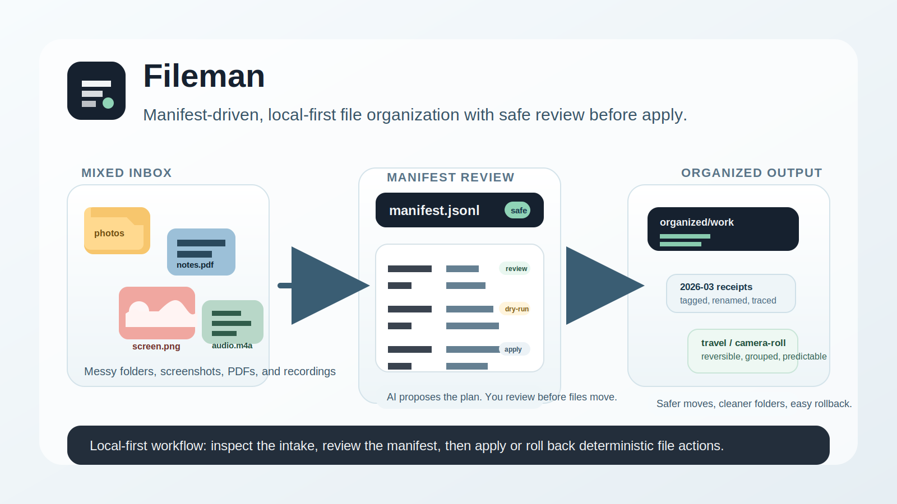

Fileman is a review-first local file organizer and workbench for messy photos, screenshots, documents, and audio. It lets AI assist with manifest drafting first, then lets you review the plan before deterministic `apply` or `rollback` touches your files.

## Start Here

- New here: read the public overview in [README.md](../README.md)
- Want the fastest safe first look: follow [Quickstart](./quickstart.md)
- Want the shortest outsider-facing trust map: open [Public Proof](./public_proof.md)
- Need the full operator route: open [Operator Guide](./usage.md)
- Need system wiring: open [Architecture](./architecture.md)
- Need release or GitHub-facing boundary rules: open [Open Source Runbook](./open_source_runbook.md)
- Need the current distribution boundary: open [Distribution](../DISTRIBUTION.md)
- Need the current client-fit map: open [Integrations](../INTEGRATIONS.md)
- Need the naming baseline: open [Brand Positioning](./brand_positioning.md)
- Need the search-intent map: open [SEO Landing Map](./seo_landing_map.md)
- Want the search-intent landing page first: open [Review-First AI File Organizer](./review_first_ai_file_manr.md)
- Need a use-case landing page first: open [Photo Organizer](./photo_organizer.md), [Screenshot Organizer](./screenshot_organizer.md), or [Receipt Organizer](./receipt_organizer.md)
- Want the agent/developer extension surface after you understand the product story: open [Fileman MCP v1](./mcp.md) and [Developer Guide](./developer_guide.md)
- Want a client-specific MCP route: open [Fileman MCP For Codex](./codex_mcp.md) or [Fileman MCP For Claude Code](./claude_code_mcp.md)

## What Makes Fileman Different

- **Review-first**: AI drafts a manifest, but file actions happen only after you inspect the plan.
- **AI-assisted**: Fileman helps propose labels, rules, and review inputs without claiming autonomous file organization.
- **Dry-run first**: the first-look route keeps `apply` in dry-run mode so you can see the intended moves safely.
- **Rollback-ready**: the same workflow keeps an audit trail for recovery instead of treating file moves like one-way guesses.
- **Local-first**: folders, manifests, and reports stay under your chosen workspace root.
- **Agent-safe extension surface**: Fileman MCP v1 exposes the same review-safe workflow to agents without adding a hidden “move files now” shortcut.

## Builder Quick Map

If you are here because of MCP, Codex, Claude Code, or a typed API substrate, choose the entry that matches the job:

This Navigation map is intentionally search-before-write friendly: pick the shortest honest door first instead of guessing which integration surface hides behind another page.

| If you want... | Open... |
| :-- | :-- |
| a Codex-friendly MCP route | [Fileman MCP For Codex](./codex_mcp.md) |
| a Claude Code-friendly MCP route | [Fileman MCP For Claude Code](./claude_code_mcp.md) |
| the generic Fileman MCP contract | [Fileman MCP v1](./mcp.md) |
| the local HTTP contract | [`contracts/api/web_api.openapi.yaml`](../contracts/api/web_api.openapi.yaml) |
| the generated TypeScript client and types | [Developer Guide](./developer_guide.md) |

## Good Fit / Not A Fit

| Good fit | Not a fit |
| :-- | :-- |
| You want help sorting a mixed intake folder without giving AI direct move authority | You want a hosted SaaS that reorganizes files with no review step |
| You care about dry-run, manifest review, and rollback | You want enterprise SLAs or guaranteed support windows |
| You want a reproducible paper trail for screenshots, PDFs, photos, and recordings | You want a fully managed storage platform |

## Next Doors

- [Quickstart / safe first look](./quickstart.md)
- [Public Proof](./public_proof.md)
- [FAQ](./faq.md)
- [Fileman MCP v1](./mcp.md)
- [Fileman MCP For Codex](./codex_mcp.md)
- [Fileman MCP For Claude Code](./claude_code_mcp.md)
- [Developer Guide](./developer_guide.md)
- [Review-First AI File Organizer](./review_first_ai_file_manr.md)
- [Photo Organizer](./photo_organizer.md)
- [Screenshot Organizer](./screenshot_organizer.md)
- [Receipt Organizer](./receipt_organizer.md)
- [Brand Positioning](./brand_positioning.md)
- [SEO Landing Map](./seo_landing_map.md)
- [Contributing](../CONTRIBUTING.md)
- [Support](../SUPPORT.md)
- [Security](../SECURITY.md)
- [Changelog](../CHANGELOG.md)
